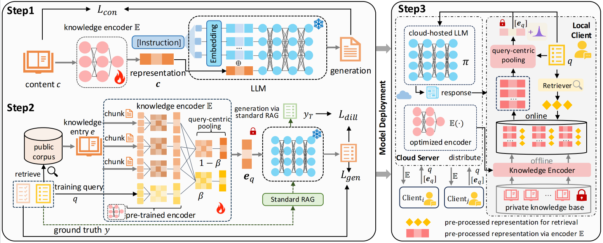

# PriRAG

Official repo for [Privacy-Preserving Cloud-based Retrieval-Augmented Generation]()

<div align=center>

</div>

## Overview
PriRAG is a privacy-preserving framework for cloud-based RAG systems that protects sensitive information while maintaining performance. Our implementation consists of three key components:

1. **knowledge Construction**: We introduce a knowledge construction mechanism within the knowledge encoder $\mathbb{E}$ that ensures the generated proxy representations are well-aligned with the embedding space of the LLM.
2. **Query-Centric Privacy-Preserving**: To further mitigate privacy leakage arising from redundant content, we propose a query-centric privacy-preserving method accompanied by a tailored training strategy. This design minimizes sensitive information exposure while ensuring that the cloud-based LLM can accurately interpret and utilize the compressed proxy representations for downstream tasks.
3. **Privacy-Preserving Collaborative Inference**: To tightly control potential privacy leakage from proxy representations, we develop a privacy-preserving collaborative inference strategy by integrating the LDP mechanism, effectively balancing the utility–privacy trade-off.


## Get Started

### Environment Setup


1. **Install Dependencies**

Install all dependencies using pip:

```bash
pip install -r requirements.txt
```

## Model & Data
- Download [enwiki-dec2021](https://github.com/facebookresearch/atlas?tab=readme-ov-file#models) as pretraining data
- Run [prepare_data.py](data/finetune/prepare_data.py) to prepare the data for finetuning

## Training
We provide [train.sh](./script/train.sh) to easily run both pretraining and finetuning. You can customize pretraining parameters in `config/pretrain.yaml` and finetuning parameters in `config/finetune.yaml`.

## Evaluation
We provide [eval.sh](./script/eval.sh) to assess model performance under different scenarios. 
For a full list of evaluation options, run:
```bash
python -m src.eval.run_eval --help
```

<!-- ## Citation
If you use PriRAG in your research, please cite our paper:
```bibtex

``` -->

<!-- ## License -->